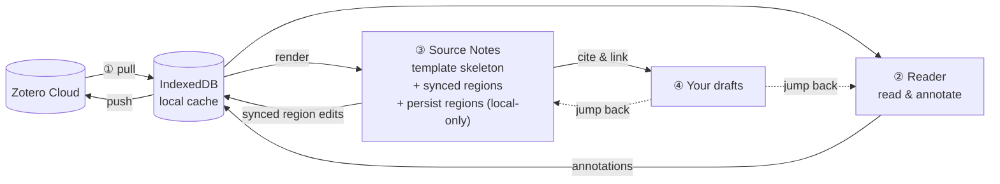

# Working Model Overview

**Literature flows in, insight flows out.** This page explains the loop behind that sentence — what data moves at each station, what syncs, and what stays yours alone. Read it once and every ZotFlow feature will have an obvious place.

## The Loop, as Data Flow

### ① In — Zotero to local cache

ZotFlow pulls items, collections, attachments, and annotations from the Zotero Web API into local IndexedDB. After the first sync you can browse, search, read, and annotate **fully offline** — the network is only needed for syncing and downloading attachments (from Zotero storage or your WebDAV server). Cached attachments are managed with a configurable LRU size limit.

Each library has its own sync mode:

| Mode              | Behavior                                                                 |
| ----------------- | ------------------------------------------------------------------------ |
| **Bidirectional** | Pull + push. Requires an API Key with write permission                   |
| **Read Only**     | Pull only. Local annotations stay local and never reach Zotero           |
| **Ignored**       | Completely skipped during sync                                           |

**What flows back to Zotero?** Annotations (add/edit/delete), Item Notes (create/edit/delete), and tags. Item metadata, frontmatter, and persist regions never flow back. When the same field changes on both sides between syncs, a **field-level diff viewer** lets you pick the winner per field — no wholesale overwrites.

Practices that reduce conflicts: keep your primary editing side fixed (either Obsidian or Zotero), and sync before editing from a second device.

### ② Read — two readers, two destinations

The built-in reader uses Zotero's rendering engine with Obsidian-matched theming, in two modes:

| Mode               | What it reads                   | Where annotations go                          |
| ------------------ | ------------------------------- | --------------------------------------------- |
| **Library Reader** | Attachments synced from Zotero  | IndexedDB → Zotero (via bidirectional sync)   |
| **Local Reader**   | Local PDF/EPUB/HTML in vault    | Co-located `.zf.json` sidecar — never Zotero  |

Annotation changes ripple forward automatically: the affected Source Note re-renders on a ~2s debounce. (Local Reader is enabled via Settings → General → Overwrite PDF/EPUB/HTML Viewer.)

### ③ Distill — content ownership inside a Source Note

Each Zotero item gets exactly one auto-rendered Markdown file — a stable, addressable node in your knowledge graph. The file is a **projection of the local cache through your template**, which raises the central question of ZotFlow's note model: *when the template re-renders, what survives?*

The answer is ownership. Every piece of content in a Source Note has one of three owners:

| Owner | Content | On re-render | Syncs to Zotero? |
| --- | --- | --- | --- |
| **Template** | metadata, annotation excerpts, headings, structure | regenerated — don't write here | — (it *comes from* Zotero) |
| **Zotero (shared, editable)** | Item Note regions, annotation comment regions | your edits preserved, written to IndexedDB | ✅ on next sync |
| **You (local)** | persist regions, custom frontmatter fields | preserved verbatim | ❌ never |

- **Zotero-owned regions** are fenced by `ZF_NOTE_*` / `ZF_ANNO_*` markers with a 🔒 lock toggle. Editing them *is* editing the Zotero object — the change flows back on sync. Item Notes can equivalently be edited in a standalone Note Editor tab; both entry points write the same record.
- **Persist regions** (`ZF_PERSIST_*` markers, declared in your template) are the place for your own words *inside* the source's page: reading notes, verdicts, todo lists. They survive every re-render and never leave your vault. If a region disappears from the template, its content moves to a clearly-bounded "Orphaned persist regions" section — never deleted.
- **Custom frontmatter fields** you add by hand are preserved as-is; template-defined fields follow the `??` merge prefix rules (see [Source Note](source-notes.md#frontmatter-always-editable)).

That table yields a simple decision guide for **where to write**:

| | Should sync to Zotero | Stays in your vault |
| --- | --- | --- |
| **About this one source** | **Item Note** — annotation extensions, paraphrases, summaries you want on every device Zotero reaches | **Persist region** — private reading notes, verdicts, workflow scratch |
| **Across sources** | — (Zotero has no cross-item note concept) | **Standalone Obsidian note** — surveys, comparisons, arguments; wikilink back to Source Notes |

Source Notes re-render automatically: after syncs that change an item (version-aware), after annotation changes (forced, debounced), after Item Note edits, or manually from the Tree View / command palette. Whatever the trigger, the ownership rules above decide what survives — by construction, everything that is yours does.

### ④ Out — citations and links that belong to both sides

Insert citations while writing by dragging items from the Tree View or typing a trigger character — output as Pandoc keys, wikilinks, footnotes, or real CSL styles rendered by citeproc (see [`citation` / `bibliography` filters](template-filters.md#citation-csl)).

Links keep their allegiance sorted: Item Notes store native `zotero://` links (so they navigate Zotero's reader when opened there) while Obsidian displays ZotFlow links that open the built-in reader. Zotero's embedded annotation highlights and citation markers are clickable too. Citations and links from your drafts jump straight back into ② and ③ — closing the loop.

## Cross-Cutting Principles

These apply at every station:

- **Template-first.** Nearly all user-visible output — note paths, Source Note bodies, citation formats — is rendered by LiquidJS templates you can edit. If you don't like the default output, change the template, not your workflow. See the [Template Guide](template-guide.md).
- **Offline-first.** Everything synced is cached locally; the loop keeps running without a network.
- **Two panels.** The **Tree View** (sidebar) is navigation: browse, search, drag-to-cite, open. The **Activity Center** (ribbon icon) is control: sync, tasks, logs, template preview, CSL styles.
- **Privacy by default.** No telemetry. Network requests go only to the Zotero API and your configured WebDAV server. Credentials live in Obsidian's platform-native `SecretStorage`, never in synced `data.json`.

## Why This Design

1. **Closed loop** — reading, annotating, and writing happen in one tool, zero context switching.
2. **Stable references** — every source has an always-present, addressable page.
3. **Clear ownership** — you always know what survives a re-render and what reaches Zotero: template content is regenerated, shared regions sync, your local content is untouchable.
4. **User control** — templates put output formatting in your hands, with no hardcoded workflows.

## Related Entry Points

- [Quick Start & Setup](getting-started.md)
- [Reader & Annotations](reading-and-annotating.md)
- [Source Note](source-notes.md)
- [Item Note](item-notes.md)
- [Citation & Writing Flow](citation-guide.md)
- [Template Guide](template-guide.md)
