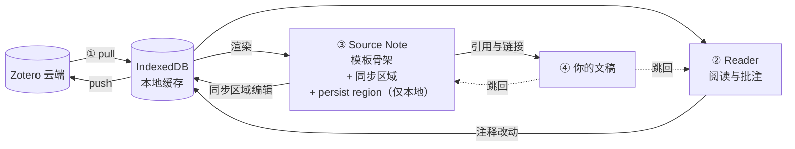

# 工作模型总览

**Literature flows in, insight flows out.** 本页解释这句话背后的循环——每一站有什么数据在动、什么会同步、什么只属于你。读完一遍，ZotFlow 的每个功能都会有明确的归属。

## 主循环：数据流视角

### ① 进 —— Zotero 到本地缓存

ZotFlow 从 Zotero Web API 拉取条目、集合、附件、注释存入本地 IndexedDB。首次同步后即可**完全离线**浏览、检索、阅读、批注——网络只在同步和下载附件（Zotero 存储或你的 WebDAV）时需要。附件缓存按可配置的 LRU 上限管理。

每个库独立配置同步模式：

| 模式 | 行为 |
| --- | --- |
| **Bidirectional** | 拉 + 推。需要带写权限的 API Key |
| **Read Only** | 只拉。本地注释留在本地，永不到达 Zotero |
| **Ignored** | 同步时完全跳过 |

**什么会回流 Zotero？**注释（增/改/删）、Item Note（建/改/删）、标签。条目元数据、frontmatter、persist region 永不回流。两端在同步间隔内改了同一字段时，**字段级 diff 视图**让你逐字段选择保留哪边——不做整条覆盖。

减少冲突的实践：固定你的主要编辑端（Obsidian 或 Zotero 其一）；换设备编辑前先同步。

### ② 读 —— 两个阅读器，两个去向

内置阅读器使用 Zotero 的渲染引擎、主题随 Obsidian，分两种模式：

| 模式 | 读什么 | 注释去哪 |
| --- | --- | --- |
| **Library Reader** | Zotero 同步来的附件 | IndexedDB → Zotero（经双向同步） |
| **Local Reader** | vault 里的本地 PDF/EPUB/HTML | 同址 `.zf.json` 旁车文件——永不到 Zotero |

注释改动自动向前传导：受影响的 Source Note 以约 2 秒防抖重渲染。（Local Reader 在 Settings → General → Overwrite PDF/EPUB/HTML Viewer 启用。）

### ③ 沉淀 —— Source Note 内的内容所有权

每个 Zotero 条目对应恰好一个自动渲染的 Markdown 文件——知识图谱中稳定、可寻址的节点。这个文件是**本地缓存经你的模板投影**的结果，由此引出 ZotFlow 笔记模型的核心问题：*模板重渲染时，什么会留下？*

答案是所有权。Source Note 中的每一块内容归三种所有者之一：

| 所有者 | 内容 | 重渲染时 | 同步到 Zotero？ |
| --- | --- | --- | --- |
| **模板** | 元数据、注释摘录、标题、结构 | 重新生成——别在这里写字 | —（它本就*来自* Zotero） |
| **Zotero（共享、可编辑）** | Item Note 区域、注释评论区域 | 你的编辑被保留，写入 IndexedDB | ✅ 下次同步 |
| **你（本地）** | persist region、自加 frontmatter 字段 | 原样保留 | ❌ 永不 |

- **Zotero 所有的区域**由 `ZF_NOTE_*` / `ZF_ANNO_*` marker 围栏，带 🔒 解锁开关。编辑它们*就是*在编辑 Zotero 对象——改动随同步回流。Item Note 也可在独立的 Note Editor 标签页中编辑；两个入口写同一条记录。
- **Persist region**（`ZF_PERSIST_*` marker，在模板中声明）是你在来源页面*内部*的书写之地：阅读笔记、评价、待办。它们在每次重渲染中存活，永不离开 vault。若某个区域从模板中消失，其内容移入边界清晰的 "Orphaned persist regions" 段——绝不删除。
- **自加 frontmatter 字段**原样保留；模板定义的字段遵循 `??` 前缀合并规则（见 [Source Note](source-notes.md#frontmatter始终可编辑)）。

由这张表可直接推出**「写在哪」决策表**：

| | 要同步到 Zotero | 只留在 vault |
| --- | --- | --- |
| **关于这一篇** | **Item Note**——注释延伸、复述、想在 Zotero 所达设备上都看到的总结 | **Persist region**——私人阅读笔记、评价、工作草稿 |
| **跨多篇** | —（Zotero 没有跨条目笔记的概念） | **独立 Obsidian 笔记**——综述、比较、论证；wikilink 连回各 Source Note |

Source Note 自动重渲染的时机：同步发现条目变化（版本感知）、注释变化（强制、防抖）、Item Note 编辑后、或从 Tree View / 命令面板手动触发。无论何种触发，上面的所有权规则决定什么留下——凡是你的，构造上就不会丢。

### ④ 出 —— 两侧都入乡随俗的引用与链接

写作时从 Tree View 拖入条目或输入触发字符插入引用——输出 Pandoc key、wikilink、脚注，或由 citeproc 渲染的真实 CSL 样式（见 [`citation` / `bibliography` filter](template-filters.md#citationcsl)）。

链接各归其主：Item Note 存储原生 `zotero://` 链接（在 Zotero 打开时由 Zotero reader 导航），Obsidian 中显示为打开内置 reader 的 ZotFlow 链接。Zotero 嵌在笔记里的高亮引文与引用标记同样可点击。文稿中的引用与链接直接跳回 ② 与 ③——循环闭合。

## 横切原则

以下原则贯穿每一站：

- **Template-first。**几乎所有用户可见输出——笔记路径、Source Note 正文、引用格式——都由你可编辑的 LiquidJS 模板渲染。不满意默认输出就改模板，不必改工作流。见[模板指南](template-guide.md)。
- **Offline-first。**同步过的一切都有本地缓存；断网时循环照常运转。
- **两个面板。** **Tree View**（侧边栏）负责导航：浏览、检索、拖拽引用、打开。**Activity Center**（ribbon 图标）负责控制：同步、任务、日志、模板预览、CSL 样式。
- **默认隐私。**无遥测。网络请求只发往 Zotero API 与你配置的 WebDAV。凭据存于 Obsidian 平台原生 `SecretStorage`，不进同步的 `data.json`。

## 为什么这样设计

1. **闭环**——阅读、批注、写作在同一工具内发生，零上下文切换。
2. **稳定引用**——每个来源都有一张始终存在、可寻址的页面。
3. **所有权清晰**——你始终知道重渲染后什么留下、什么到达 Zotero：模板内容重生成、共享区域同步、你的本地内容不可侵犯。
4. **用户掌控**——模板把输出格式交到你手里，没有硬编码的工作流。

## 相关入口

- [快速开始与设置](getting-started.md)
- [阅读器与批注](reading-and-annotating.md)
- [Source Note](source-notes.md)
- [Item Note](item-notes.md)
- [引用与写作流](citation-guide.md)
- [模板指南](template-guide.md)
